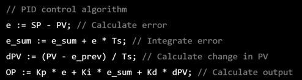
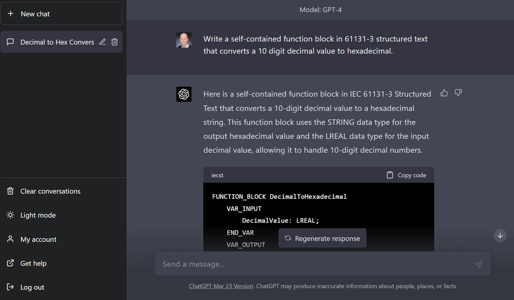

# Control Logic Generation Prompts

This repository contains a collection of natural language prompts to generate control logic in [IEC 61131-3](https://en.wikipedia.org/wiki/IEC_61131-3) [Structured Text](https://en.wikipedia.org/wiki/Structured_text) using [Large Language Models](https://en.wikipedia.org/wiki/Large_language_model) (LLM). The collection is structured in categories:

- Standard Algorithms
- Mathematical Functions
- PLC Programming Tasks
- Process Control
- Sequential Control
- Interlocks
- Diagnostics / Communication
- Advanced Process Control
- Various Engineering Inputs
- Programmer Support

The [complete list of prompts](prompts/README.md) contains their exact formulation. The prompts are meant as initial examples to test the capabilities and limitations of LLMs in the context of control programming. Some of them are inspired by real engineering projects, but they are abstracted to be generally usable. The range of heterogeneous categories is intended to cover different aspects of control programming. The prompts may be refined and enhanced to improve the quality of the generated answers. Domain-specific prompt engineering patterns could be derived, which could then inform control engineers in formulating specific prompts for a task at hand.

For testing the capabilities of LLMs to generate source code in IEC 61131-3 Structured Text notation, we have fed the prompts to [ChatGPT](https://chat.openai.com/chat) with the [GPT-4](https://openai.com/research/gpt-4) LLM, and [saved](prompts) the generated answers. An [Excel Workbook](chatgpt/ChatGPT-Prompts-PLC-Programming.xlsm) is available to filter and sort the results. An exact replication of these answers is perhaps impossible due to the non-deterministic nature of LLMs. Still it should be possible to produce at least similarly useful answers with the same prompts.

